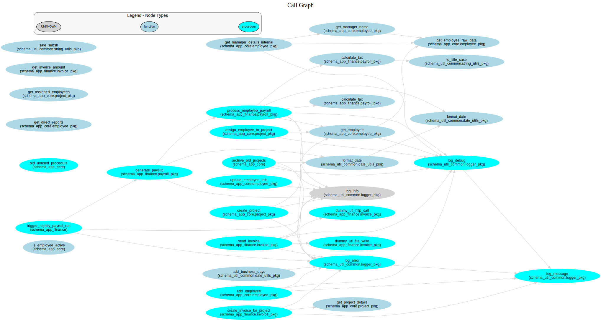

# CodeMorph

**A powerful toolkit for LLM-assisted, semi-automated code migration from legacy PL/SQL to modern Java SpringBoot applications.**

[](https://python.org)
[](#license)
[](#project-status)

## 🎯 Overview

CodeMorph is a comprehensive toolkit designed to facilitate the migration of legacy PL/SQL codebases to modern Java SpringBoot applications. The project leverages advanced static analysis, dependency graph visualization, and LLM assistance to make complex code migrations more manageable and systematic.

### Key Objectives

- **🔍 Deep Code Analysis**: Extract and analyze structural information from PL/SQL codebases
- **📊 Dependency Visualization**: Create interactive dependency graphs for architectural understanding
- **🛠️ Migration Planning**: Identify migration units, cycles, and critical paths
- **🤖 LLM Integration**: Leverage AI assistance for code transformation and optimization
- **📈 Impact Analysis**: Understand the ripple effects of proposed changes

### Project Status

CodeMorph is currently in active development with a focus on:
- **Phase 1**: PL/SQL analysis and dependency graph generation ✅
- **Phase 2**: Advanced graph analysis and visualization features 🚧
- **Phase 3**: LLM-assisted code migration capabilities 📋
- **Phase 4**: Java SpringBoot target generation 📋

## 🏗️ Architecture

CodeMorph follows a modular architecture with two core packages:

```
CodeMorph/
├── packages/
│   ├── plsql_analyzer/           # PL/SQL source code analysis
│   └── dependency_analyzer/      # Dependency graph analysis & visualization
├── src/codemorph/               # Main orchestration layer
├── demo/                        # Demo data and examples
└── docs/                        # Documentation
```

## 📦 Packages

### 1. **PL/SQL Analyzer** (`plsql-analyzer`)

The foundational package that parses and extracts metadata from PL/SQL source code.

**Core Features:**
- **Structural Parsing**: Identifies packages, procedures, functions, and their relationships
- **Signature Analysis**: Extracts detailed parameter information and return types
- **Call Graph Extraction**: Maps dependencies between PL/SQL objects
- **Code Cleaning**: Preprocesses code for analysis by removing comments and literals
- **Persistent Storage**: SQLite database for metadata and processing status
- **Change Detection**: Processes only modified files based on content hashing

**Key Outputs:**
- SQLite database with extracted metadata
- Detailed procedure/function signatures
- Call dependency relationships
- Code complexity metrics

### 2. **Dependency Analyzer** (`dependency-analyzer`)

Advanced graph analysis and visualization tool for understanding code dependencies.

**Core Features:**
- **Graph Construction**: Build complete dependency graphs from PL/SQL metadata
- **Subgraph Generation**: Extract focused views around specific nodes
- **Node Classification**: Automatic identification of hubs, utilities, orphans, and terminals
- **Cycle Detection**: Find and analyze circular dependencies
- **Interactive Visualization**: Web-based graphs with Graphviz and Pyvis
- **Reachability Analysis**: Discover upstream/downstream dependencies
- **Path Finding**: Shortest paths between any two nodes

**Key Outputs:**
- Interactive dependency visualizations
- Graph analysis reports
- Migration planning insights
- Architectural documentation

## 🚀 Installation

CodeMorph supports modern Python package managers and requires **Python >= 3.12**.

### Method 1: Using uv (Recommended)

[uv](https://docs.astral.sh/uv/) is a fast Python package and project manager:

```bash
# Clone the repository
git clone https://github.com/HrushikeshPawar/CodeMorph.git
cd CodeMorph

# Install all workspace packages
uv sync --all-packages

# For development with all dev dependencies
uv sync --all-packages --all-groups
```

### Method 2: Using pip

Traditional pip installation:

```bash
# Clone the repository
git clone https://github.com/yourusername/CodeMorph.git
cd CodeMorph

# Install the main package (includes both sub-packages)
pip install .

# For development installation
pip install -e .[dev]
```

### Individual Package Installation

You can also install packages individually:

```bash
# Install only PL/SQL Analyzer
cd packages/plsql_analyzer
uv sync  # or pip install .

# Install only Dependency Analyzer
cd packages/dependency_analyzer
uv sync  # or pip install .
```

### Verify Installation

```bash
# Check PL/SQL Analyzer
plsql-analyzer --help

# Check Dependency Analyzer
dependency-analyzer --help

# Check main CodeMorph entry point
codemorph --help
```

## 🎯 Quick Start

### 1. Analyze PL/SQL Source Code

```bash
# Initialize PL/SQL analyzer configuration
plsql-analyzer init --output-path ./plsql_config.toml

# Analyze your PL/SQL source directory
plsql-analyzer analyze \
  --source-dir ./demo/dummy_plsql_source \
  --output-dir ./generated/artifacts \
  --config-file ./plsql_config.toml \
  --verbose 2
```

This creates a SQLite database with extracted metadata: `./generated/artifacts/PLSQL_CodeObjects.db`

### 2. Build and Analyze Dependency Graphs

```bash
# Initialize dependency analyzer configuration
dependency-analyzer init

# Build a complete dependency graph
dependency-analyzer build full \
  --config dep_analyzer_config.toml \
  --db ./generated/artifacts/PLSQL_CodeObjects.db \
  --output-fname project_dependencies

# Classify nodes by architectural role
dependency-analyzer analyze classify \
  --config dep_analyzer_config.toml \
  --graph-path project_dependencies.graphml

# Detect problematic cycles
dependency-analyzer analyze cycles \
  --config dep_analyzer_config.toml \
  --graph-path project_dependencies.graphml
```

### 3. Create Interactive Visualizations

```bash
# Generate an interactive dependency visualization
dependency-analyzer visualize graph \
  --config dep_analyzer_config.toml \
  --graph-path project_dependencies.graphml \
  --output project_overview

# Create a focused subgraph around a specific component
dependency-analyzer visualize subgraph \
  --config dep_analyzer_config.toml \
  --db ./generated/artifacts/PLSQL_CodeObjects.db \
  --node-id "schema_app_core.process_payment" \
  --downstream-depth 3 \
  --upstream-depth 2 \
  --output-image payment_dependencies
```

### 4. Query and Explore

```bash
# Find what depends on a specific procedure
dependency-analyzer query reachability \
  --config dep_analyzer_config.toml \
  --graph-path project_dependencies.graphml \
  --node-id "schema_app_core.validate_user"

# Find paths between two components
dependency-analyzer query paths \
  --config dep_analyzer_config.toml \
  --graph-path project_dependencies.graphml \
  --source "schema_app_core.authenticate" \
  --target "schema_app_finance.calculate_bill"

# List most connected components
dependency-analyzer query list \
  --config dep_analyzer_config.toml \
  --graph-path project_dependencies.graphml \
  --sort-by degree \
  --limit 10
```

## 📊 Example Output

### Dependency Graph Visualization


### Node Classification Results
```
Hub Nodes (12 found):
  - schema_app_core.user_manager: degree=45, betweenness=0.23
  - schema_util_common.data_validator: degree=38, betweenness=0.19
  
Utility Nodes (8 found):
  - schema_util_common.string_utils: out_degree=0, in_degree=31
  - schema_util_common.date_utils: out_degree=0, in_degree=28

Orphan Nodes (3 found):
  - schema_app_core.legacy_backup: degree=0
  - schema_app_finance.old_calculator: degree=0

Terminal Nodes (15 found):
  - schema_app_core.send_notification: out_degree=0, in_degree=12
  - schema_app_finance.generate_report: out_degree=0, in_degree=8
```

### Cycle Detection Results
```
Found 2 problematic cycles:

Cycle 1 (length: 3):
  schema_app_core.user_manager → 
  schema_app_core.session_handler → 
  schema_app_core.auth_validator → 
  schema_app_core.user_manager

Cycle 2 (length: 4):
  schema_app_finance.billing_engine → 
  schema_app_finance.payment_processor → 
  schema_app_core.transaction_logger → 
  schema_app_finance.audit_trail → 
  schema_app_finance.billing_engine
```

## ⚙️ Configuration

Both packages use TOML configuration files for flexible customization:

### PL/SQL Analyzer Configuration

```toml
[extraction]
source_directory = "./demo/dummy_plsql_source"
output_base_directory = "./generated/artifacts"
enable_profiler = false

[database]
db_file_name = "PLSQL_CodeObjects.db"

[file_processing]
file_extensions = [".sql", ".pks", ".pkb", ".prc", ".fnc"]
excluded_patterns = ["**/backup/**", "**/temp/**"]

[logging]
log_level = "INFO"
enable_file_logging = true
```

### Dependency Analyzer Configuration

```toml
[paths]
output_base_dir = "./generated/artifacts"
database_path = "./generated/artifacts/PLSQL_CodeObjects.db"

[visualization]
default_visualization_engine = "graphviz"
with_package_name_labels = true
show_visualization_legend = true

[analysis]
hub_degree_percentile = 0.95
utility_out_degree_percentile = 0.90
orphan_component_max_size = 2

[visualization.package_colors]
SCHEMA_APP_CORE = "#FF6B6B"
SCHEMA_APP_FINANCE = "#4ECDC4"
SCHEMA_UTIL_COMMON = "#45B7D1"
```

## 🔧 Advanced Usage

### Custom Analysis Workflows

```bash
# Multi-stage analysis with custom parameters
dependency-analyzer build full --db ./data/prod_plsql.db --output-fname prod_graph
dependency-analyzer analyze classify --graph-path prod_graph.graphml --config custom_analysis.toml
dependency-analyzer visualize subgraph --node-id "critical_procedure" --downstream-depth 5
```

## 📖 Documentation

### Package Documentation
- **[PL/SQL Analyzer Guide](./packages/plsql_analyzer/README.md)** - Detailed usage and configuration
- **[Dependency Analyzer Guide](./packages/dependency_analyzer/README.md)** - Graph analysis and visualization
  - **[API Reference](./packages/dependency_analyzer/docs/API_REFERENCE.md)** - Complete CLI command reference
  - **[Configuration Guide](./packages/dependency_analyzer/docs/CONFIGURATION.md)** - Configuration options and examples
  - **[Examples Collection](./packages/dependency_analyzer/docs/EXAMPLES.md)** - Real-world usage scenarios

### Project Documentation
- Dependency Analyzer
  - **[Contributing Guidelines](./packages/dependency_analyzer/CONTRIBUTING.md)** - Development setup and contribution process
  - **[Roadmap](./planning/roadmaps/)** - Future development plans

## 🛠️ Development

### Development Setup

```bash
# Clone and setup development environment
git clone https://github.com/yourusername/CodeMorph.git
cd CodeMorph

# Install with development dependencies
uv sync --group dev

# Install pre-commit hooks (optional)
pre-commit install
```

### Running Tests

```bash
# Run all tests
uv run pytest

# Run tests for specific package
uv run pytest packages/plsql_analyzer/tests/
uv run pytest packages/dependency_analyzer/tests/

# Run with coverage
uv run pytest --cov=src --cov-report=html
```

### Code Quality

```bash
# Format code
uv run ruff format

# Lint code
uv run ruff check

# Type checking
uv run mypy src/
```

## 🤝 Contributing

We welcome contributions! Please see our [Contributing Guidelines](./packages/dependency_analyzer/CONTRIBUTING.md) for details on:

- Development setup and workflow
- Code style and testing requirements
- Documentation standards
- Submitting pull requests

### Areas for Contribution

- **🔧 Core Features**: Enhanced parsing, analysis algorithms
- **📊 Visualizations**: New chart types, interactive features
- **🌐 Web Interface**: React frontend development
- **🤖 LLM Integration**: AI-assisted migration features
- **📚 Documentation**: Examples, tutorials, API docs
- **🧪 Testing**: Unit tests, integration tests, performance tests

## 📊 Project Metrics

```
Languages Supported:     PL/SQL → Java SpringBoot
Analysis Capabilities:   15+ graph metrics, cycle detection, path analysis
Visualization Engines:   Graphviz, Pyvis, NetworkX
Export Formats:         GraphML, GEXF, JSON, PNG, SVG, HTML
Database Storage:       SQLite with full metadata persistence
CLI Commands:           25+ commands across 2 packages
```

## 🗺️ Roadmap

### Current Focus (2025 Q2)
- ✅ Complete dependency analysis suite
- 🚧 Advanced graph metrics and analysis
- 🚧 Enhanced visualization capabilities
- 📋 FastAPI backend for web interface

### Upcoming Features (2025 Q3-Q4)
- 📋 React-based web interface
- 📋 LLM integration for code translation
- 📋 Java SpringBoot code generation
- 📋 Migration progress tracking

### Future Vision (2026+)
- 📋 Multi-language support (COBOL, VB.NET, etc.)
- 📋 Cloud-native deployment options
- 📋 Enterprise collaboration features
- 📋 Advanced AI-assisted refactoring

## 📄 License

This project is licensed under the MIT License - see the [LICENSE](LICENSE) file for details.

## 🙏 Acknowledgments

- **NetworkX** - Graph analysis and manipulation
- **Graphviz** - Graph visualization engine  
- **Pyvis** - Interactive network visualizations
- **Loguru** - Advanced logging capabilities
- **Pydantic** - Data validation and settings management
- **Click** - Command-line interface framework

## 📞 Support

- **📧 Email**: hrushikesh.vpawar@gmail.com
- **🐛 Issues**: [GitHub Issues](https://github.com/HrushikeshPawar/CodeMorph/issues)
- **💬 Discussions**: [GitHub Discussions](https://github.com/HrushikeshPawar/CodeMorph/discussions)
- **📖 Documentation**: [Project Wiki](https://github.com/HrushikeshPawar/CodeMorph/wiki)

---

**Made with ❤️ for the legacy code migration community**

> *"Transforming yesterday's code into tomorrow's applications"*